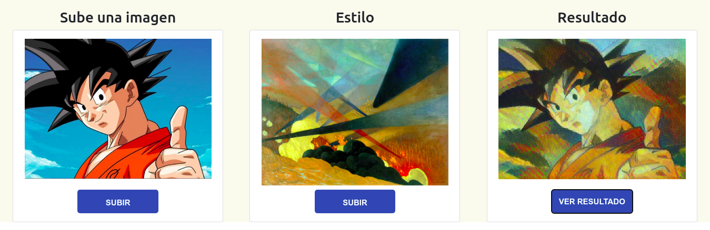

# neural-style-transfer-tfjs
Aplicación web usando un modelo de neural style transfer (NST) en tensorflow.js

# Motivación
La transferencia de estilo nos permite obtener una imagen completamente nueva, a partir de una imagen de contenido, y una imagen de estilo, tal que la imagen resultante contiene el tema de la imagen de contenido, pero utilizando la técnica de imagen de la de estilo. En esta sencilla aplicación web, les muestro dicha operación, utilizando un modelo realizado en tensorflow (https://tfhub.dev/google/magenta/arbitrary-image-stylization-v1-256/2), basado en el paper:  Exploring the structure of a real-time, arbitrary neural artistic stylization network. Golnaz Ghiasi, Honglak Lee, Manjunath Kudlur, Vincent Dumoulin, Jonathon Shlens, Proceedings of the British Machine Vision Conference (BMVC), 2017.
El modelo fue descargado en un formato de tensorflow hub, y convertido a formato .json para trabajarlo con Tensorflow.js. Alojado en una página estática, pueden realizarse pruebas con cualquier imagen de contenido y estilo.

# Ejemplo:

